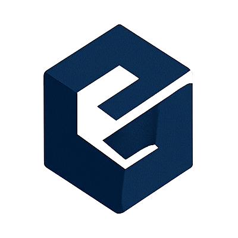

<h1 align="center">
  <br>
  <strong>EVIBLOCK</strong>
</h1>

<p align="center">
  <a href="https://66eua-kiaaa-aaaam-aeiha-cai.icp0.io/" target="_blank">
    
  </a>
  <p align = "center">
  
  
  </p>
</p>

<p align="center">
  <em><strong>Blockchain-Based Digital Evidence Verification</strong></em><br><br>
  Upload and verify files with decentralized trust.<br>
  Ensure a tamper-proof chain of custody for cybercrime,<br>legal investigations,
  and<br>general-purpose digital file verification.<br><br>
   <strong>Secure</strong> &nbsp;|&nbsp;  <strong>Transparent</strong> &nbsp;|&nbsp;  <strong>Simple</strong>
</p>

<br><br>

# Getting Started
To get started, you might want to explore the project directory structure and the default configuration file. Working with this project in your development environment will not affect any production deployment or identity tokens.

To learn more before you start working with `evi_block`, see the following documentation available online:

-  [Quick Start](https://internetcomputer.org/docs/current/developer-docs/setup/deploy-locally)  
-  [SDK Developer Tools](https://internetcomputer.org/docs/current/developer-docs/setup/install)  
-  [Rust Canister Development Guide](https://internetcomputer.org/docs/current/developer-docs/backend/rust/)  
-  [ic-cdk](https://docs.rs/ic-cdk)  
-  [ic-cdk-macros](https://docs.rs/ic-cdk-macros)  
-  [Candid Introduction](https://internetcomputer.org/docs/current/developer-docs/backend/candid/)  


If you want to start working on your project right away, you might want to try the following commands:

```bash
cd evi_block/
dfx help
dfx canister --help
```

## Running the project locally

If you want to test your project locally, you can use the following commands:

```bash
# Starts the replica, running in the background
dfx start --background

# Deploys your canisters to the replica and generates your candid interface
dfx deploy
```

Once the job completes, your application will be available at `http://localhost:4943?canisterId={asset_canister_id}`.

If you have made changes to your backend canister, you can generate a new candid interface with

```bash
npm run generate
```

at any time. This is recommended before starting the frontend development server, and will be run automatically any time you run `dfx deploy`.

If you are making frontend changes, you can start a development server with

```bash
npm start
```

Which will start a server at `http://localhost:8080`

<h2 align="center"> Meet the Team</h2>

<div align="center">
  <table>
    <tr>
      <td align="center" width="200">
        <br>
        <strong>Vibhas Dutta</strong><br>
        <em>Project Lead / Full Develpoment</em><br>
        <a href="https://github.com/vibhasdutta">GitHub ↗</a>
      </td>
      <td align="center" width="200">
        <br>
        <strong>Surventurer</strong><br>
        <em>Backend / Smart Contract / Rust</em><br>
        <a href="https://github.com/Surventurer">GitHub ↗</a>
      </td>
    </tr>
    <tr>
      <td align="center" width="200">
        <br>
        <strong>Rajeev.</strong><br>
        <em>Frontend Developer</em><br>
        <a href="https://github.com/rajeev-cyber">GitHub ↗</a>
      </td>
      <td align="center" width="200">
        <br>
        <strong>cyber_haul</strong><br>
        <em>Frontend Developer</em><br>
        <a href="https://github.com/Deepdiwa">GitHub ↗</a>
      </td>
    </tr>
  </table>
</div>


<h2 align="center"> Support This Project</h2>

<p align="center">
  If you find <strong>EVIBLOCK</strong> helpful, give it a star to show your support and help others discover it!<br>
  Your star motivates us to keep improving and building more secure tools like EviBlock.
</p>

<p align="center">
  <a href="https://github.com/vibhasdutta/EVIBLOCK">
    
  </a>
</p>

